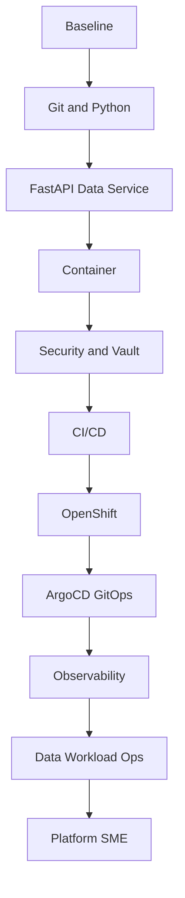

# Phased Plan of Action

This plan converts the book into an execution path for a Python data engineer becoming a DevOps engineer.

## Phase 0: Orientation and Baseline

Goal: establish the repository, cluster access, progress tracking, and learning rhythm.

Hands-on outcomes:

- Confirm `oc login`.
- Record cluster details.
- Create learning namespaces.
- Start tracking progress in `progress/status.md`.

Evidence:

- `oc whoami`
- `oc get projects`
- created namespaces

## Phase 1: Version Control and Python Foundations

Goal: make every learning activity reproducible and versioned.

Topics:

- Git basics through release workflow
- branch strategy
- commit discipline
- `uv`
- dependency locking
- virtual environments
- local quality checks

Hands-on project:

- Create a `uv` based FastAPI data service.
- Add tests, linting, typing, and structured project layout.

## Phase 2: Data Service Packaging

Goal: turn Python data logic into an operable service.

Topics:

- FastAPI
- Pydantic models
- environment configuration
- health and readiness
- metrics endpoints
- structured logging

Hands-on project:

- Build a dataset metadata API with `/health`, `/ready`, `/metrics`, and one domain endpoint.

## Phase 3: Containers and Registries

Goal: package the service as an OpenShift-friendly container.

Topics:

- Dockerfile design
- Docker vs Podman
- image layers
- non-root execution
- image tags
- external registries

Hands-on project:

- Build, run, scan, and publish the FastAPI data service image.

Note: the cluster internal registry is currently removed, so start with an external registry.

## Phase 4: Security and Vault

Goal: protect code, dependencies, images, and sensitive values.

Topics:

- SAST
- dependency scanning
- image scanning
- SBOM
- secret scanning
- HashiCorp Vault
- Kubernetes auth
- secret injection patterns

Hands-on project:

- Store service credentials in Vault.
- Inject secrets into the OpenShift workload without committing values to Git.

## Phase 5: CI/CD

Goal: automate validation, image publishing, and deployment promotion.

Topics:

- CI stages
- CD stages
- quality gates
- artifact promotion
- immutable image tags
- deployment metadata updates

Hands-on project:

- Create a pipeline that installs with `uv`, tests, scans, builds, publishes, and updates GitOps manifests.

## Phase 6: OpenShift Deployment

Goal: deploy and troubleshoot the data service on OpenShift.

Topics:

- projects
- deployments
- pods
- services
- routes
- config maps
- service accounts
- RBAC
- probes
- resource limits

Hands-on project:

- Deploy the FastAPI data service to `data-devops-lab`.

## Phase 7: GitOps with ArgoCD

Goal: move deployment control into Git.

Topics:

- desired state
- drift
- sync
- Kustomize overlays
- promotion
- rollback

Hands-on project:

- Create the first ArgoCD application for the FastAPI data service.

## Phase 8: Observability

Goal: make the service supportable.

Topics:

- logs
- metrics
- traces
- OpenTelemetry
- OpenMetrics
- Prometheus
- Grafana
- Datadog
- alerts
- runbooks

Hands-on project:

- Build a dashboard showing request health and data workload health.

## Phase 9: Data Workload Operations

Goal: extend DevOps patterns from APIs to jobs and pipelines.

Topics:

- CronJobs
- batch jobs
- retries
- dead-letter handling
- backfills
- idempotency
- data quality signals

Hands-on project:

- Deploy a scheduled ingestion simulation and write its operational runbook.

## Phase 10: Platform and SME Readiness

Goal: make the engineer capable of supporting teams independently.

Topics:

- golden paths
- templates
- CNCF ecosystem
- policy-as-code
- platform support
- incident response
- AI-assisted operations

Hands-on project:

- Deliver the capstone and create a reusable onboarding template for future Python data services.

## Completion Diagram

