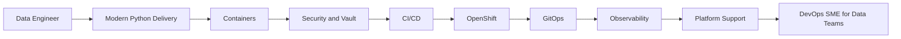

# Data Engineer to DevOps Engineer Learning Path

This repository is a living curriculum for an experienced Python data engineer who is learning DevOps, OpenShift, GitOps, observability, security, and platform support.

The journey is organized as a book, progress tracker, reusable operational skills, hands-on labs, and Reveal.js slide decks.

## Current Cluster Context

The local OpenShift login was verified on 2026-05-29.

| Item | Value |
| --- | --- |
| User | `kube:admin` |
| API | `https://api.okd.rhels.com:6443` |
| Console | `https://console-openshift-console.apps.okd.rhels.com` |
| OKD | `4.21.0-okd-scos.7` |
| Kubernetes | `v1.34.2` |
| Topology | Single-node / single-replica |
| Network | `OVNKubernetes` |
| ArgoCD | Installed in `argocd` |
| Monitoring | OpenShift monitoring installed |
| Datadog | Agent installed in `datadog` |
| Kyverno | Installed, but pods show high restart counts |
| Internal registry | Removed |
| Storage classes | None found |

## Repository Map

```text
book/
  SUMMARY.md
  chapters/
docs/
  tutorials/
  github-issues/
  review-prompts/
progress/
  status.md
skills/
  README.md
  *.md
slides/
  index.html
  topics/
labs/
diagrams/
agent.md
```

## Learning Flow



## Start Here

1. Read [book/SUMMARY.md](book/SUMMARY.md).
2. Open [progress/status.md](progress/status.md) and mark the starting status.
3. Read [agent.md](agent.md) before asking an AI agent to continue work in this repository.
4. Use [slides/index.html](slides/index.html) to review the topic decks.
5. Use [skills/README.md](skills/README.md) for repeatable operational activities.
6. Follow [docs/tutorials/fastapi-uv-python-project.md](docs/tutorials/fastapi-uv-python-project.md) to create the first FastAPI project with `uv`.

## Suggested First Cluster Projects

```bash
oc new-project data-devops-lab
oc new-project data-devops-gitops
oc new-project data-devops-observability
oc new-project data-devops-vault
```
