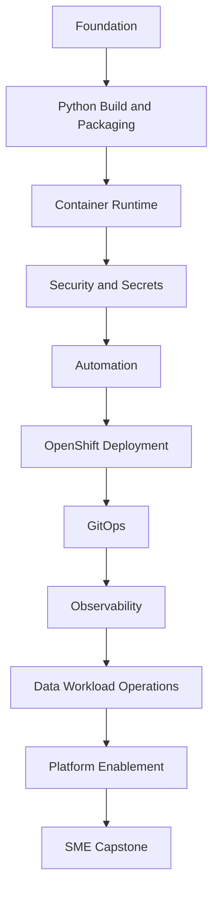

# Book Summary

Working title: **From Data Engineer to DevOps Engineer**

This book teaches the complete software delivery lifecycle from a DevOps perspective, customized for a Python data engineer.

The learner will build, secure, deploy, observe, and operate a FastAPI-based data service and related data workload patterns on OpenShift.

## Chapter List

| Chapter | Topic | Slide Deck | Status |
| --- | --- | --- | --- |
| 00 | Orientation and Roadmap | `slides/topics/00-orientation.html` | Not Started |
| 01 | DevOps for Data Engineers | `slides/topics/01-devops-for-data-engineers.html` | Not Started |
| 02 | Version Control A to Z | `slides/topics/02-version-control.html` | Not Started |
| 03 | Modern Python with uv | `slides/topics/03-python-uv.html` | Not Started |
| 04 | FastAPI Data Service Packaging | `slides/topics/04-fastapi-packaging.html` | Not Started |
| 05 | Containers with Docker and Podman | `slides/topics/05-containers.html` | Not Started |
| 06 | Security Scanning and Supply Chain | `slides/topics/06-security-scanning.html` | Not Started |
| 07 | HashiCorp Vault and Secrets | `slides/topics/07-vault-secrets.html` | Not Started |
| 08 | CI/CD Pipeline Design | `slides/topics/08-cicd.html` | Not Started |
| 09 | OpenShift Fundamentals | `slides/topics/09-openshift.html` | Not Started |
| 10 | ArgoCD and GitOps | `slides/topics/10-gitops-argocd.html` | Not Started |
| 11 | Configuration Management | `slides/topics/11-configuration.html` | Not Started |
| 12 | Observability Fundamentals | `slides/topics/12-observability.html` | Not Started |
| 13 | Data Workload Operations | `slides/topics/13-data-workloads.html` | Not Started |
| 14 | CNCF and Platform Engineering | `slides/topics/14-cncf-platform.html` | Not Started |
| 15 | AI-Assisted DevOps | `slides/topics/15-ai-assisted-devops.html` | Not Started |
| 16 | Capstone and SME Readiness | `slides/topics/16-capstone.html` | Not Started |

## End State

By the end, the engineer should be able to:

- Build Python data services with reproducible dependencies.
- Package and run FastAPI services.
- Build secure container images.
- Scan code, dependencies, and images.
- Use Vault-backed secret management.
- Design CI/CD pipelines.
- Deploy to OpenShift.
- Use ArgoCD for GitOps.
- Observe services and data workloads using logs, metrics, and traces.
- Support application and data teams independently.
- Build repeatable platform patterns and documentation.

## Journey Diagram

