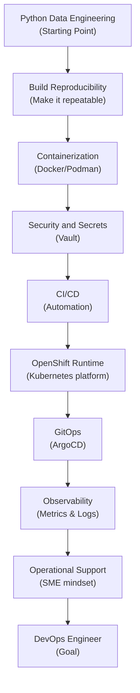

# Chapter 00: Orientation and Roadmap

## Learning Objectives

- Understand the purpose of this learning path and your starting point.
- Grasp the complete journey from Python data engineer to DevOps SME.
- Learn how the book, labs, slides, skills, and progress tracker fit together.
- Understand the role of the shared OpenShift cluster, Vault, ArgoCD, and observability tools.
- Set up and confirm access to the learning environment.

## Who You Are and Where We Are Going

You are an experienced Python data engineer. You are comfortable building data pipelines, working with APIs, querying SQL, scheduling batch jobs, and ensuring data quality. However, the world of DevOps—deploying infrastructure, managing CI/CD pipelines, handling secrets securely, and operating production applications via OpenShift and GitOps—is new to you.

This book is designed to bridge that gap. We will build on your existing Python data engineering skills and gradually introduce the missing DevOps practices, enabling you to become a fully capable DevOps Engineer. 

## How to Use This Repository

This repository is your central hub for learning. It contains:
- **Book Chapters**: Step-by-step explanations and labs (like this one).
- **Labs**: Hands-on exercises using the shared OpenShift cluster.
- **Slides**: High-level overviews to review key concepts.
- **Progress Tracker**: A simple way to document your completed milestones.
- **Reusable Skills**: Configurations and scripts you can carry into real projects.

## The Journey Ahead

Before diving in, it is crucial to understand the "why" and "how" of this progression.

1. **Build Reproducibility**: We start by packaging your Python pipelines so they can run anywhere reliably.
2. **Containerization**: We move from local environments to containers, the standard unit of deployment.
3. **Security and Secrets**: We introduce HashiCorp Vault so you learn how to handle sensitive data without exposing it in Git.
4. **CI/CD**: We automate testing and building images, laying the foundation for reliable delivery.
5. **OpenShift Runtime**: We deploy those containers to a real Kubernetes environment.
6. **GitOps**: Using ArgoCD, we shift from manual deployments to declarative infrastructure managed purely through Git.
7. **Observability**: We add tools to monitor, log, and alert on system health, making production operations transparent.
8. **Operational Support**: We bring it all together by troubleshooting and supporting platforms as a true DevOps SME.
Throughout this journey, AI-assisted development will help accelerate our learning and implementation.



## The Learning Platform

Our shared platform is an OpenShift cluster equipped with industry-standard tools:
- **OpenShift**: The enterprise Kubernetes engine where our applications run.
- **ArgoCD**: The engine driving our GitOps methodology.
- **Vault**: The secure vault for our secrets.
- **Observability Stack**: Tools like Datadog and OpenShift monitoring for visibility.

## Hands-On Lab

1. Confirm your OpenShift access:

   ```bash
   oc whoami
   oc get projects
   ```

2. Create your learning namespaces:

   ```bash
   oc new-project data-devops-lab
   oc new-project data-devops-gitops
   oc new-project data-devops-observability
   oc new-project data-devops-vault
   ```

3. Open `progress/status.md` and check off Chapter 00 to update your progress.

## Knowledge Check

- What is the difference between writing a data application and operating it?
- Why do we learn about Secrets and Vault before deploying to OpenShift?
- What does GitOps change about deployment ownership?
- How will you track your progress through this journey?

## Learner Self-Assessment

Before proceeding to Chapter 01, ensure you can honestly answer "yes" to these statements:
- [ ] I understand my starting point as a Data Engineer and the goal of becoming a DevOps Engineer.
- [ ] I can explain the end-to-end learning path and why topics are ordered this way.
- [ ] I know how the book, labs, progress tracker, and slides connect.
- [ ] I know which OpenShift cluster will be used and understand the roles of ArgoCD and Vault.
- [ ] I have successfully completed the hands-on orientation lab and updated my status.

