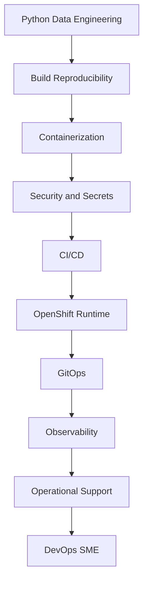

# Chapter 00: Orientation and Roadmap

## Learning Objectives

- Understand the full journey from Python data engineer to DevOps engineer.
- Know how the book, labs, slides, skills, and progress tracker fit together.
- Establish the OpenShift cluster as the shared learning platform.

## Data Engineering Context

A data engineer usually thinks in terms of pipelines, data products, APIs, files, tables, schedules, and reliability. DevOps adds the delivery and operations layer: how those systems are built, secured, shipped, observed, recovered, and improved.

## Roadmap



## Hands-On Lab

1. Confirm OpenShift access:

   ```bash
   oc whoami
   oc get projects
   ```

2. Create learning namespaces:

   ```bash
   oc new-project data-devops-lab
   oc new-project data-devops-gitops
   oc new-project data-devops-observability
   oc new-project data-devops-vault
   ```

3. Update `progress/status.md` with the result.

## Knowledge Check

- What is the difference between writing a data application and operating it?
- Why does a data engineer need observability?
- Why should secrets not be stored in Git?
- What does GitOps change about deployment ownership?

## Confidence Checklist

- I can explain the end-to-end learning path.
- I know where progress is tracked.
- I know which OpenShift cluster will be used.
- I know how chapters, skills, and slides connect.

