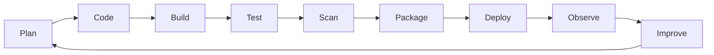

# Chapter 01: DevOps for Data Engineers

## Learning Objectives

- Translate DevOps concepts into data-engineering language.
- Understand the software delivery lifecycle.
- Identify operational responsibilities for data services and pipelines.

## Core Concepts

DevOps is the practice of making delivery, operations, reliability, and feedback part of everyday engineering. For data engineers, this means data APIs, ingestion jobs, transformation services, and orchestration code must be reproducible, testable, secure, observable, and deployable.

## Delivery Lifecycle

## Data Workload Responsibilities

- Data freshness
- Data quality
- Pipeline latency
- Schema compatibility
- Backfill safety
- Idempotency
- Operational runbooks
- Access control
- Secret rotation

## Hands-On Lab

Pick one data workload you know. Write down:

- Inputs
- Outputs
- Runtime
- Dependencies
- Secrets
- Failure modes
- Metrics needed
- Deployment method

Store the result in `labs/workload-profile.md`.

## Knowledge Check

- What are the stages of the software delivery lifecycle?
- What is different about operating a data pipeline compared with a web API?
- What does it mean for a pipeline to be idempotent?
- Which operational signals would prove a data job is healthy?

## Confidence Checklist

- I can map data-engineering work to DevOps lifecycle stages.
- I can name operational risks in data workloads.
- I can describe the feedback loop from production back to development.

