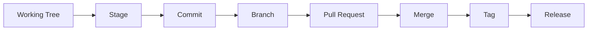

# Chapter 02: Version Control A to Z

## Learning Objectives

- Use Git as the system of record for learning, code, infrastructure, and operations.
- Understand branches, commits, pull requests, tags, releases, and rollback.
- Apply version-control discipline to application code and platform manifests.

## Core Concepts

Version control is more than saving code. It is audit history, collaboration workflow, rollback mechanism, release traceability, and the foundation of GitOps.

## Git Lifecycle



## A to Z Topics

- Repository initialization
- `.gitignore`
- Branch naming
- Commit messages
- Diffs
- Staging partial changes
- Pull requests
- Code review
- Tags and releases
- Reverts
- Cherry-picks
- Merge conflicts
- Protected branches
- Signed commits
- GitOps repositories

## Hands-On Lab

1. Create a feature branch:

   ```bash
   git switch -c codex/chapter-02-version-control
   ```

2. Update this chapter with a note.
3. Review the diff:

   ```bash
   git diff
   ```

4. Commit the change.

## Knowledge Check

- What is the difference between `git add` and `git commit`?
- Why are small commits easier to review?
- Why is GitOps impossible without disciplined version control?
- When would you revert instead of rewriting history?

## Confidence Checklist

- I can create branches and commits.
- I can explain a pull request workflow.
- I can use Git history for rollback and traceability.
- I can keep secrets out of Git.

