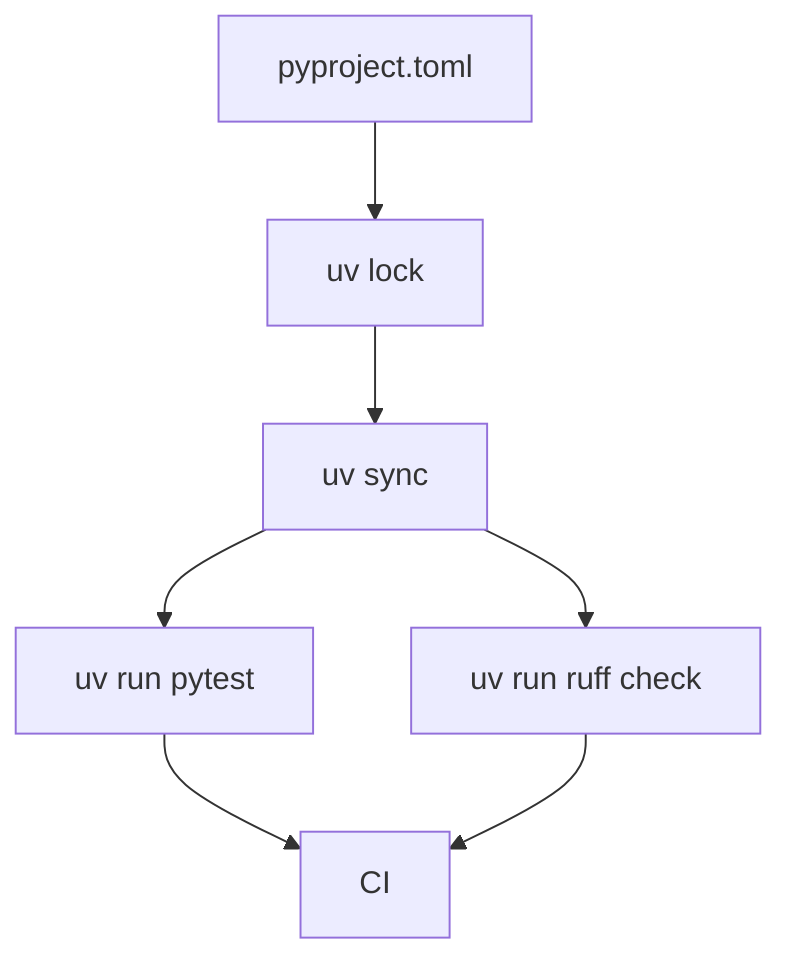

# Chapter 03: Modern Python with uv

## Learning Objectives

- Use `uv` for reproducible Python development.
- Manage dependencies, virtual environments, and lock files.
- Structure Python data services for build and test automation.

## Core Concepts

`uv` provides fast dependency resolution, virtual environment management, lock files, and command execution. For DevOps, the key outcome is reproducibility: the same dependencies locally, in CI, and in containers.

## Python Delivery Flow



## Hands-On Lab

Create a Python project:

```bash
uv init fastapi-data-service
cd fastapi-data-service
uv add fastapi uvicorn pydantic-settings
uv add --dev pytest ruff mypy
uv lock
uv run python --version
```

Add scripts in `pyproject.toml` for test, lint, and run.

## Knowledge Check

- Why is a lock file important?
- What is the difference between runtime and development dependencies?
- How does `uv run` improve reproducibility?
- Why should CI use the same dependency workflow as local development?

## Confidence Checklist

- I can create a `uv` project.
- I can add runtime and dev dependencies.
- I can run tools through `uv`.
- I understand why dependency locking matters.

