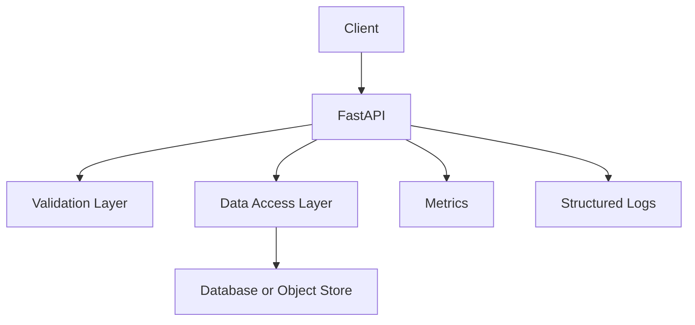

# Chapter 04: FastAPI Data Service Packaging

## Learning Objectives

- Package and run a FastAPI service.
- Design a data-service API with health, readiness, and metrics endpoints.
- Prepare the app for containerization and deployment.

## Data Engineering Context

FastAPI can expose data products, metadata APIs, feature endpoints, ingestion triggers, and validation services. DevOps readiness means the service can be configured, tested, observed, and shut down cleanly.

## Service Shape

## Required Endpoints

- `/health`: process is alive
- `/ready`: dependencies are reachable
- `/metrics`: Prometheus/OpenMetrics
- `/docs`: OpenAPI documentation
- Domain endpoint, for example `/datasets/{name}`

## Hands-On Lab

Build a FastAPI app with:

- typed request and response models
- configuration from environment variables
- structured logging
- unit tests
- readiness check that validates a fake dependency

## Knowledge Check

- What is the difference between liveness and readiness?
- Why should configuration come from the environment?
- Why are typed models valuable for data APIs?
- What should a readiness endpoint check?

## Confidence Checklist

- I can run a FastAPI app locally.
- I can test endpoints.
- I can package the service for automation.
- I understand operational endpoints.

