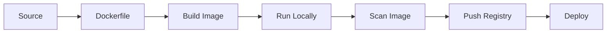

# Chapter 05: Containers with Docker and Podman

## Learning Objectives

- Build container images for Python data services.
- Understand layers, entrypoints, users, and runtime configuration.
- Run containers locally before deploying to OpenShift.

## Core Concepts

Containers package an application with the runtime files it needs. OpenShift adds stricter security expectations, so images should run without root privileges and avoid assumptions about fixed user IDs.

## Container Flow



## Hands-On Lab

Create a container image:

```bash
podman build -t fastapi-data-service:dev .
podman run --rm -p 8000:8000 fastapi-data-service:dev
curl http://localhost:8000/health
```

Use an external registry because the OpenShift internal image registry is currently removed.

## Knowledge Check

- What is a container layer?
- Why should images run as non-root?
- What belongs in `.dockerignore`?
- Why scan images before publishing?

## Confidence Checklist

- I can build and run an image locally.
- I can explain Docker vs Podman at a practical level.
- I can design an OpenShift-friendly image.
- I understand image tags and registries.

