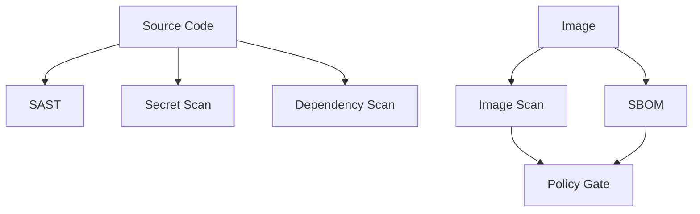

# Chapter 06: Security Scanning and Supply Chain

## Learning Objectives

- Scan source code, dependencies, and container images.
- Understand SBOMs and vulnerability severity.
- Add security gates to CI/CD.

## Security Flow



## Tools

- `ruff`: code quality
- `bandit`: Python security checks
- `pip-audit`: dependency vulnerabilities
- `trivy`: filesystem and image scanning
- `syft`: SBOM generation
- `grype`: vulnerability analysis
- `cosign`: signing and verification

## Hands-On Lab

Run scans:

```bash
ruff check .
bandit -r app
pip-audit
trivy fs .
trivy image <image>
syft <image> -o spdx-json
```

## Knowledge Check

- What is an SBOM?
- Why do dependency vulnerabilities matter for data services?
- What is the difference between finding and fixing a vulnerability?
- What vulnerabilities should block a release?

## Confidence Checklist

- I can scan code, dependencies, and images.
- I can explain critical, high, medium, and low findings.
- I can document accepted risk.
- I can add a security gate to a pipeline.

