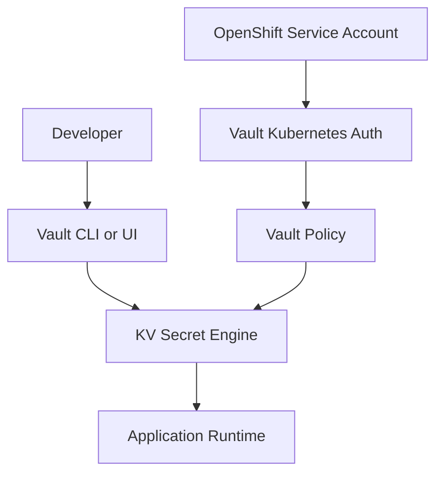

# Chapter 07: HashiCorp Vault and Secrets

## Learning Objectives

- Use Vault as the system of record for sensitive data.
- Understand Kubernetes authentication with Vault.
- Choose a secret injection pattern for OpenShift workloads.

## Why Vault

Data engineers frequently handle database passwords, API tokens, object storage keys, signing keys, and service credentials. Vault centralizes access, policy, audit logging, and rotation.

## Vault Pattern



## Injection Options

- Vault Agent Injector
- External Secrets Operator
- CSI Secrets Store
- Application-level Vault client

## Hands-On Lab

Design a secret path:

```text
kv/data/data-devops/dev/fastapi-data-service
```

Document:

- secret names
- owner
- rotation interval
- consuming service account
- Vault policy
- injection approach

## Knowledge Check

- Why are Kubernetes Secrets not enough by themselves?
- What is least privilege?
- What is secret rotation?
- What should be stored in Git when Vault is used?

## Confidence Checklist

- I can identify sensitive values.
- I can design a Vault path and policy.
- I can explain runtime secret injection.
- I can keep secret values out of Git.

