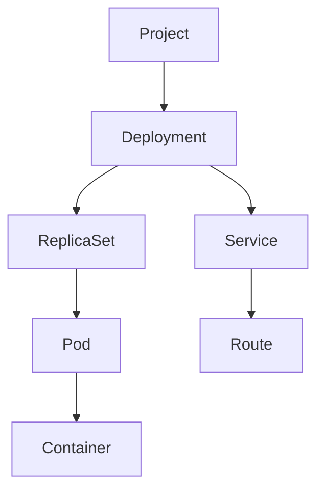

# Chapter 09: OpenShift Fundamentals

## Learning Objectives

- Deploy and troubleshoot workloads on OpenShift.
- Understand projects, pods, deployments, services, routes, and RBAC.
- Use the current OKD cluster for hands-on learning.

## Cluster Context

This learning environment is a single-node OKD cluster with ArgoCD, monitoring, Datadog, and Kyverno available. The internal image registry is removed, so labs should initially publish images to an external registry.

## Workload Model



## Hands-On Lab

Deploy the FastAPI data service with:

- `Deployment`
- `Service`
- `Route`
- `ConfigMap`
- `Secret` or Vault-backed reference
- readiness and liveness probes
- resource requests and limits

## Troubleshooting Commands

```bash
oc get pods
oc describe pod <pod>
oc logs <pod>
oc get events --sort-by=.lastTimestamp
oc rollout status deploy/<name>
```

## Knowledge Check

- What is the difference between a Service and a Route?
- Why do pods restart?
- What does a readiness probe protect?
- What does RBAC control?

## Confidence Checklist

- I can deploy a workload.
- I can expose it with a route.
- I can inspect logs and events.
- I can troubleshoot a failed rollout.

