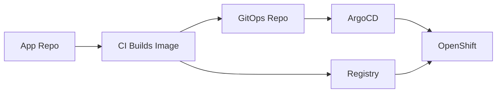

# Chapter 10: ArgoCD and GitOps

## Learning Objectives

- Understand GitOps principles.
- Use ArgoCD to sync desired state to OpenShift.
- Manage environment overlays with Kustomize or Helm.

## GitOps Flow



## Current Cluster

ArgoCD is running in the `argocd` namespace. No `Application` resources exist yet, so the first GitOps lab can start cleanly.

## Hands-On Lab

Create:

```text
gitops/
  apps/
    fastapi-data-service/
      base/
      overlays/
        dev/
        test/
        prod/
```

Then create an ArgoCD `Application` that points to the `dev` overlay.

## Knowledge Check

- What is desired state?
- What is configuration drift?
- Why should ArgoCD deploy from Git instead of from a local laptop?
- How does rollback work in GitOps?

## Confidence Checklist

- I can explain GitOps.
- I can create an ArgoCD app.
- I can use overlays for environments.
- I can detect and correct drift.

