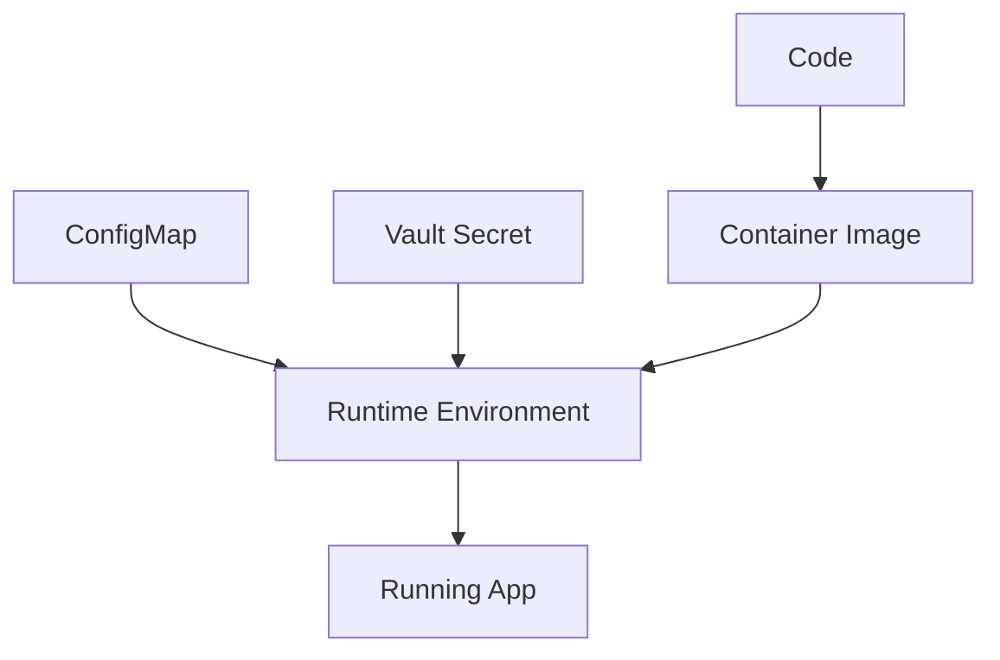

# Chapter 11: Configuration Management

## Learning Objectives

- Separate code, config, and secrets.
- Use ConfigMaps, environment variables, and Vault-backed secrets.
- Promote configuration safely across environments.

## Configuration Model

## Rules

- Code goes in Git.
- Non-sensitive config goes in Git.
- Secret references go in Git.
- Secret values go in Vault.
- Environment-specific config belongs in overlays.

## Hands-On Lab

Add configuration for:

- database host
- database name
- feature flag
- batch size
- API token from Vault

## Knowledge Check

- What is the difference between a ConfigMap and a Secret?
- Why should config differ by environment?
- Why should secret references be versioned?
- What is a safe rotation process?

## Confidence Checklist

- I can classify values as code, config, or secret.
- I can use environment overlays.
- I can design a rotation-friendly configuration pattern.

