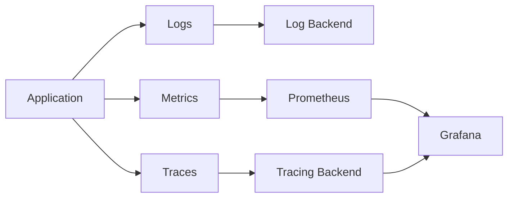

# Chapter 12: Observability Fundamentals

## Learning Objectives

- Understand logs, metrics, and traces.
- Use OpenTelemetry and OpenMetrics concepts.
- Build dashboards and alerts for data services.

## Observability Flow

## Data Engineering Signals

- freshness lag
- records processed
- failed records
- processing duration
- dependency latency
- schema validation failures
- retry count
- dead-letter count

## Hands-On Lab

Add:

- structured JSON logs
- `/metrics`
- request duration histogram
- records processed counter
- OpenTelemetry trace spans
- Grafana dashboard draft

## Knowledge Check

- What question do logs answer?
- What question do metrics answer?
- What question do traces answer?
- Why are data freshness and correctness observability concerns?

## Confidence Checklist

- I can explain logs, metrics, and traces.
- I can define useful data workload metrics.
- I can build a basic dashboard.
- I can troubleshoot with signals instead of guessing.

