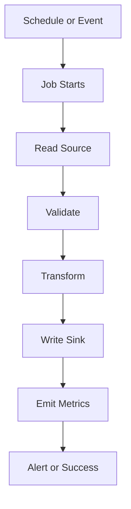

# Chapter 13: Data Workload Operations

## Learning Objectives

- Operate data-specific workloads on OpenShift.
- Understand jobs, cron jobs, retries, backfills, and idempotency.
- Design support patterns for data teams.

## Workload Types

- long-running APIs
- batch jobs
- scheduled jobs
- streaming consumers
- file ingestion workers
- data validation services

## Operations Model

## Hands-On Lab

Create an OpenShift `CronJob` that simulates a data ingestion job and emits:

- started timestamp
- records processed
- failed records
- duration
- completion status

## Knowledge Check

- What makes a backfill risky?
- Why is idempotency important?
- How should failed records be handled?
- What is a dead-letter pattern?

## Confidence Checklist

- I can design an operationally safe data job.
- I can explain retries and backfills.
- I can define job-level metrics.
- I can write a runbook for a failed pipeline.

