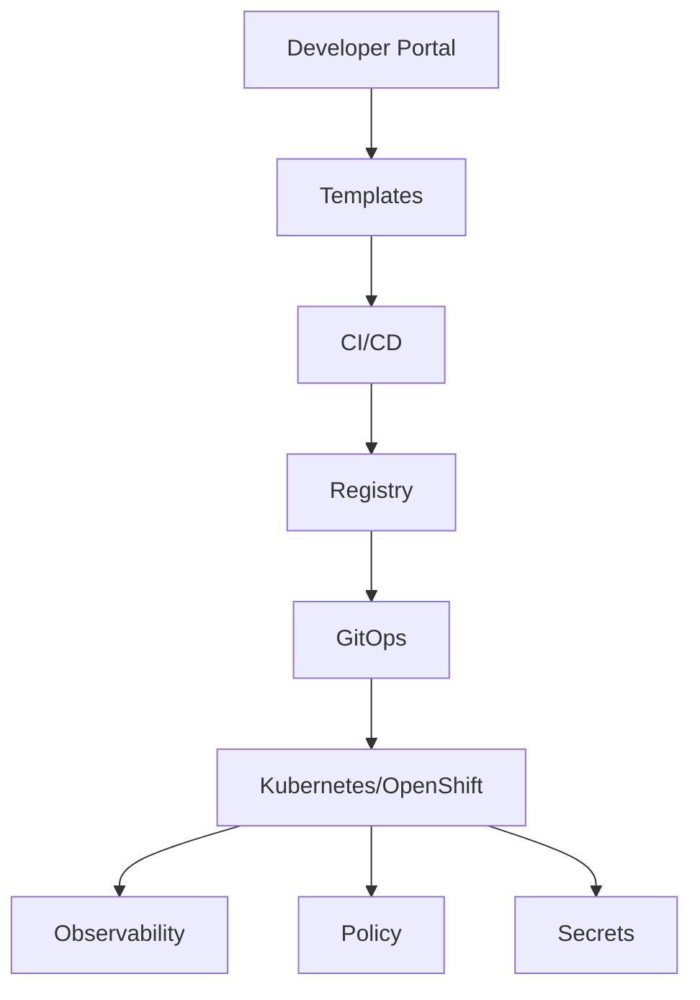

# Chapter 14: CNCF and Platform Engineering

## Learning Objectives

- Understand the broader CNCF ecosystem.
- Recognize common platform building blocks.
- Design golden paths for application and data teams.

## Platform Map

## Topics

- Kubernetes architecture
- Helm
- Kustomize
- ArgoCD
- Tekton/OpenShift Pipelines
- Prometheus
- Grafana
- OpenTelemetry
- Kyverno
- OPA Gatekeeper
- cert-manager
- external-secrets
- Backstage

## Hands-On Lab

Create a golden path checklist for a new Python data service:

- repo template
- `uv` setup
- Dockerfile
- CI pipeline
- GitOps manifests
- Vault secret pattern
- metrics and dashboard
- runbook

## Knowledge Check

- What is a golden path?
- What is the difference between a platform and a cluster?
- Why do teams need paved roads?
- How does policy-as-code help platform teams?

## Confidence Checklist

- I can identify major CNCF components.
- I can explain platform engineering goals.
- I can design a reusable service template.

