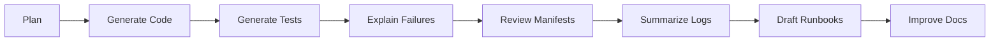

# Chapter 15: AI-Assisted DevOps

## Learning Objectives

- Use AI agents safely throughout the software delivery lifecycle.
- Identify high-value AI use cases for DevOps and data engineering.
- Apply review and verification discipline to AI-generated work.

## AI Assistance Map

## Good Uses

- explaining unfamiliar manifests
- creating starter tests
- drafting dashboards
- summarizing CI failures
- writing runbooks
- generating Mermaid diagrams
- suggesting troubleshooting commands

## Guardrails

- Do not paste secrets into prompts.
- Verify generated code.
- Scan generated dependencies.
- Review generated YAML.
- Test before deploying.
- Require human approval for production-impacting actions.

## Hands-On Lab

Ask an AI agent to:

1. Generate a troubleshooting checklist for a failed OpenShift deployment.
2. Review the output.
3. Test each command.
4. Save the verified checklist under `labs/`.

## Knowledge Check

- What tasks are safe for AI assistance?
- What tasks require human approval?
- Why should generated manifests be reviewed?
- How can AI help during incidents?

## Confidence Checklist

- I can use AI as a productivity tool.
- I can verify AI-generated output.
- I can avoid leaking sensitive data.
- I can use AI to accelerate operations without losing control.

