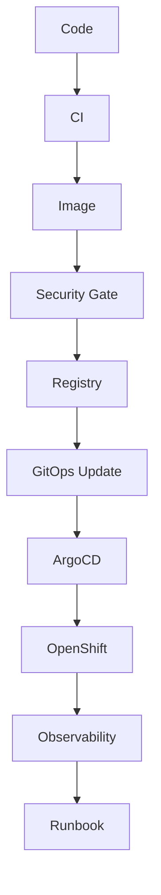

# Chapter 16: Capstone and SME Readiness

## Learning Objectives

- Prove end-to-end DevOps capability.
- Support a realistic Python data service on OpenShift.
- Demonstrate readiness to help application and data teams.

## Capstone Scenario

Build and operate a FastAPI data service that exposes dataset metadata and runs a scheduled ingestion simulation.

The capstone must include:

- `uv` project
- FastAPI service
- unit tests
- container image
- vulnerability scanning
- external registry publishing
- OpenShift deployment
- Vault-managed secret
- ArgoCD GitOps
- metrics, logs, and traces
- dashboard
- alert
- runbook
- versioned release

## Capstone Flow

## SME Readiness Review

The engineer should be able to answer:

- How do we onboard a new Python data service?
- How do we keep secrets out of Git?
- How do we promote changes safely?
- How do we know the service is healthy?
- How do we troubleshoot a failed deployment?
- How do we recover from a bad release?
- How do we support another team without becoming a bottleneck?

## Knowledge Check

- What is the full path from commit to production?
- Which parts are automated?
- Which parts require approval?
- Which operational signals matter most?

## Confidence Checklist

- I can deliver the capstone end to end.
- I can explain every lifecycle stage.
- I can support app and data teams independently.
- I can create reusable platform guidance.

